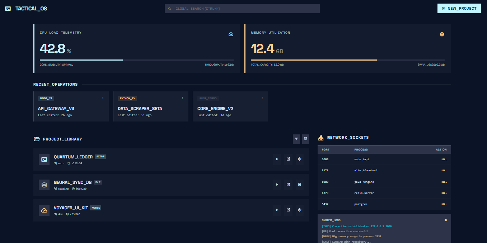

<div align="center">

#  Dev Dashboard

*A sleek, local-first project launcher and system telemetry dashboard for developers.*

[](./LICENSE)
[](https://vuejs.org/)
[](https://expressjs.com/)
[](https://www.typescriptlang.org/)



</div>

##  Overview

**Dev Dashboard** is a comprehensive, local-first command center for developers managing multiple repositories. It consolidates project management, system telemetry, network socket monitoring, and background process execution into a single, beautifully designed interface.

Say goodbye to terminal clutter and scattered notes. Manage all your local projects, environments, and server ports from one tactical operations screen.

##  Key Features

- ** System Telemetry**: Real-time CPU load and memory utilization tracking.
- ** Project Library**: Organize, tag, and pin your local repositories. Bulk import projects directly from parental directories.
- ** Multi-Command Execution**: Define and run multiple custom scripts (e.g., `npm run dev`, `cargo build`) per project with specific working directories.
- ** Network Socket Management**: Monitor active local ports and instantly kill hanging processes.
- ** Live Command Logs**: Integrated terminal output for running services with explicit kill-switch capabilities.
- ** Local-First & Secure**: Zero cloud dependency. All data, notes, and activity are stored securely in local JSON/SQLite files.

##  Tech Stack

- **Frontend:** Vue 3 (Composition API), TypeScript, Vite, Tailwind CSS
- **Backend:** Node.js, Express
- **Database:** Local JSON & SQLite integrations (Zero-config)

##  Quick Start

### Prerequisites
- [Node.js](https://nodejs.org/) (v18 or higher)
- npm (v9 or higher)

### 1. Installation
Clone the repository and install both frontend and backend dependencies:

```bash
git clone https://github.com/Suhar121/Project_Organizer.git dev-dashboard
cd dev-dashboard

# Install Frontend
cd frontend && npm install

# Install Backend
cd ../backend && npm install
```

### 2. Running Locally

**Start the Backend:**
```bash
cd backend
npm start
# Runs on http://localhost:6001
```

**Start the Frontend:**
```bash
cd frontend
npm run dev
# Runs on http://localhost:5173
```

**Windows Users:**
Alternatively, double-click the `start-dashboard.bat` file in the root directory to instantly boot both the backend and frontend simultaneously.

##  Repository Layout

```text
.
 backend/              # Express API & Local SQLite/JSON Data
 frontend/             # Vue 3 App & Tailwind styling
 start-dashboard.bat   # Windows initialization script
 README.md
```

##  Recent Updates

- **UI/UX Refinements**: Introduced custom scrollbars and viewport bounds for large dialogs (like the Edit Project Dialog).
- **Multiple Saved Commands**: Updated Project Cards to display and execute multiple custom play buttons dynamically.
- **Design & Theming Fixes**: Restored missing Tailwind theme variables (`--color-error`) and text map bindings across textarea inputs to solve visual blindspots.
- **TypeScript Stability**: Eliminated blocking Vue-TSC compiling errors and strict linter exceptions.

##  Contributing

Contributions, issues, and feature requests are welcome!
Feel free to check out the [issues page](https://github.com/Suhar121/Project_Organizer/issues) to propose new ideas or report bugs.

##  License

This project is licensed under the MIT License.
